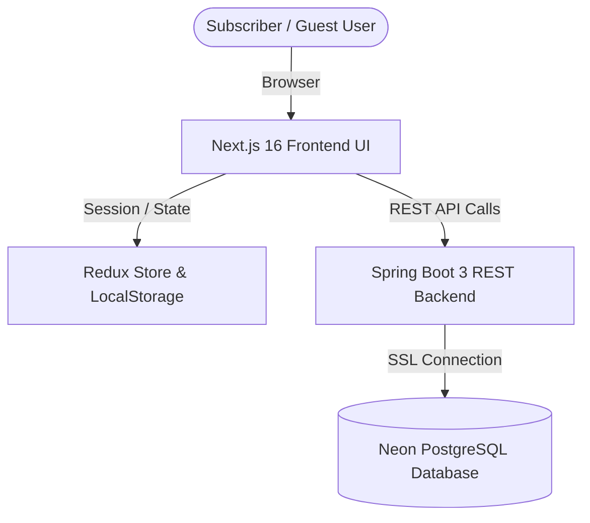

# RechargeSys Frontend &bull; Next.js 16 &amp; React 19


A modern, responsive, and high-performance **Mobile Prepaid Recharge Portal** built with Next.js 16, React 19, and Redux Toolkit. Designed with a clean fintech aesthetic, seamless guest browsing, subscriber authentication, and real-time telecom tariff exploration.

🔗 **Backend Repository:** [Sudharsan755/rechargesystem-backend](https://github.com/Sudharsan755/rechargesystem-backend)

---

## 🏛️ System Architecture



---

## ✨ Features & User Flows

1. **🏠 Landing Page & Guest Mode**:
   - Welcome banner with options to **Sign In** or **Continue as Guest**.
   - 4-operator quick selection grid (Airtel, Jio, Vodafone Idea, BSNL).
2. **📱 Telecom Tariff Catalog**:
   - Browse packs filtered by operator with 5G, Daily Data, and Unlimited Voice badges.
   - Live instant search filter by price, data limit, or validity.
   - **Guest Protection**: Guests can browse plans, but clicking a plan prompts authentication before proceeding to recharge checkout.
3. **💳 Recharge Checkout**:
   - Multiple simulated payment channels: **UPI**, **Debit / Credit Card**, and **Net Banking**.
   - Input validation for phone numbers, UPI IDs, 16-digit cards, CVV, and expiry dates.
4. **📊 Subscriber Dashboard & Receipt Ledger**:
   - Account overview showing registered mobile number, total transactions, and total expenditure.
   - Filterable transaction history with telecom operator badges and status indicators.
   - Top-right avatar chip (`Dashboard`) present on every page for logged-in subscribers.
5. **🔐 Admin Control Panel (`/admin/dashboard`)**:
   - **User Directory**: View and search all registered subscribers with avatar badges and phone chips.
   - **Transaction Ledger**: Live transaction volume tracker and audit logs.
   - **Tariff Plan Management**: Add, edit pricing/data, or delete prepaid packages.

---

## 🛠️ Tech Stack

- **Framework**: Next.js 16 (Turbopack) with App Router
- **UI Library**: React 19
- **State Management**: Redux Toolkit & React-Redux
- **Styling**: Modern CSS Design System (clean gradients, responsive grids, accessible contrast)
- **HTTP Client**: Axios & Fetch API
- **Backend API**: [Spring Boot 3 Backend](https://github.com/Sudharsan755/rechargesystem-backend)

---

## 💻 Local Development Setup

### 1. Clone Repository
```bash
git clone https://github.com/Sudharsan755/rechargesystem-frontend.git
cd rechargesystem-frontend
```

### 2. Install Dependencies
```bash
npm install
```

### 3. Configure Environment Variables
Create a `.env.local` file in the root directory:
```env
NEXT_PUBLIC_API_URL=http://localhost:8080
SPRING_BOOT_URL=http://localhost:8080
USE_SPRING_BOOT=true
```

### 4. Start Development Server
```bash
npm run dev
```
Open [http://localhost:3000](http://localhost:3000) in your browser.

---

## ☁️ Deployment

### Option 1: Deploy to Vercel (Recommended for Frontend)
1. Import `Sudharsan755/rechargesystem-frontend` into [Vercel](https://vercel.com).
2. Set Environment Variables:
   - `NEXT_PUBLIC_API_URL`: Your deployed backend URL (e.g., `https://your-backend.up.railway.app`)
   - `SPRING_BOOT_URL`: Your deployed backend URL
3. Deploy!

### Option 2: Deploy to Railway
1. Click **New Project** ➔ **Deploy from GitHub repo** in Railway.
2. Select `Sudharsan755/rechargesystem-frontend`.
3. Add the `NEXT_PUBLIC_API_URL` environment variable pointing to your backend service.

---

## 🔒 License
MIT License &bull; Built by [Sudharsan](https://github.com/Sudharsan755).
